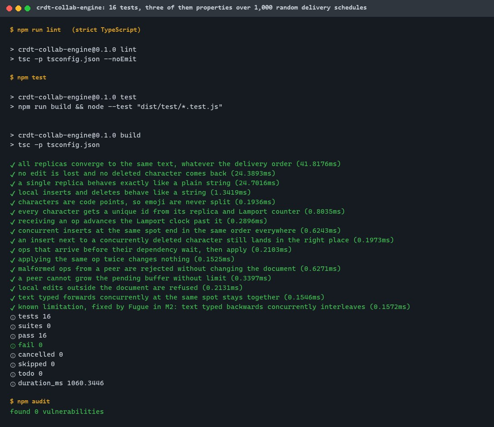
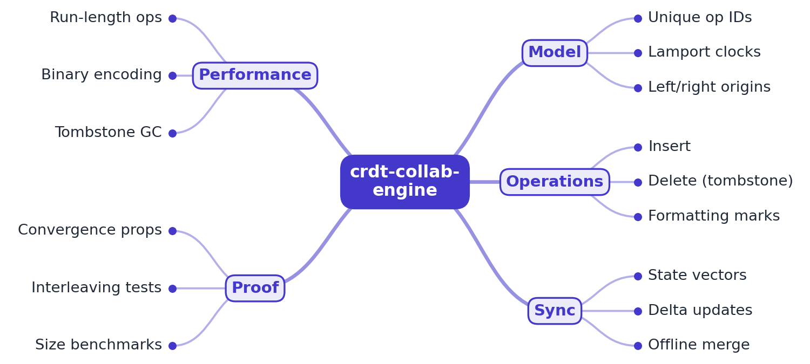
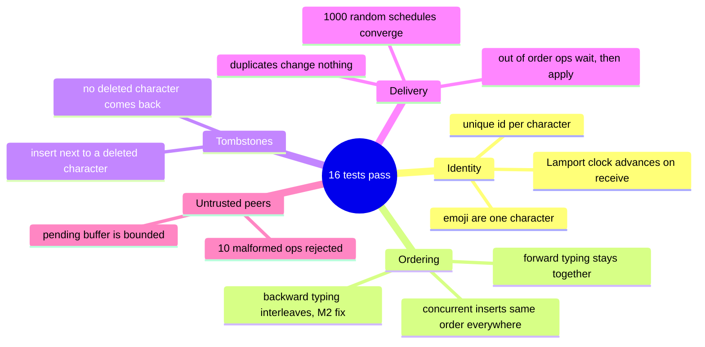

# crdt-collab-engine

[](https://github.com/EquinoxWN/crdt-collab-engine/actions/workflows/ci.yml)


> Lets many people edit one document at once and never lose an edit: a sequence CRDT where every replica converges to the same text whatever order edits arrive in, checked over thousands of random schedules.

Part of my **Distributed Systems & Storage** list · TypeScript · core project

## Proof it works

16 tests pass, three of them properties checked over 1,000 random delivery schedules each: every replica converges to the same text whatever order operations arrive in, and no edit is lost or resurrected. The known limitation (interleaving of text typed backwards concurrently) is pinned by a test so the M2 fix will show. npm audit finds nothing:



## Architecture

**What M1 runs today:**


**Full roadmap (M1 to M3):**



## How it works

_Steps 1, 2 and 6 are built and tested; the rest is on the [roadmap](#roadmap)._

1. Every character gets a unique ID (replicaId, counter). Inserts record the IDs of their neighbours, so a position is expressed by identity rather than by index.
2. Deletes turn characters into tombstones instead of removing them, so concurrent edits that reference them still resolve correctly.
3. A deterministic ordering rule (Fugue) places concurrent inserts at the same spot without the text-interleaving anomalies that break older algorithms.
4. Replicas exchange state vectors and send only the operations the other side is missing, so offline edits merge cleanly on reconnect.
5. Consecutive typing is stored as runs and encoded with variable-length integers; tombstones are garbage-collected once every replica has seen them.
6. fast-check generates random multi-replica edit sequences and delivery orders, and asserts that every replica ends with identical text.

## Tech stack

| Area | In M1 | Planned |
|---|---|---|
| Core | TypeScript, RGA-style sequence CRDT, Lamport ids, tombstones | Fugue ordering, state-vector sync, varint encoding, tombstone GC |
| Test | node:test, fast-check properties | Benchmarks against Yjs and Automerge |
| Demo | - | Two-pane browser editor with a simulated network |

Language: **TypeScript** (strict, compiled with `tsc` 7), no runtime dependencies.

| Path | What it is |
|---|---|
| `src/id.ts` | `Id` (replica, Lamport counter), total order and map key |
| `src/ops.ts` | Insert and delete operations, validation of untrusted ops |
| `src/replica.ts` | `Replica`: local edits, `apply`, RGA integration, tombstones, bounded pending buffer |
| `test/replica.test.ts` | Unit tests for every rule, including malformed ops and the known interleaving limit |
| `test/convergence.test.ts` | fast-check properties over random multi-replica schedules |

## Run it

Needs Node.js 24 or newer.

```bash
make setup   # npm ci
make lint    # strict TypeScript type check
make test    # 16 tests, including 3 properties x 1,000 random schedules
make audit   # npm audit
```

Use it from code:

```ts
import { Replica } from "crdt-collab-engine";

const alice = new Replica("alice");
const bob = new Replica("bob");
const ops = alice.insert(0, "hello");   // send these to peers in any order
for (const op of ops) bob.apply(op);     // bob.toString() === "hello"
```

## Tests and results

Latest local run (full detail in [docs/results/m1.md](docs/results/m1.md)):

| Check | Result |
|---|---|
| Unit tests (ids, tombstones, ordering, buffering, duplicates, validation) | 13 passed, 0 failed |
| Property: all replicas converge, any delivery order (2-4 replicas, out-of-order and duplicated messages) | 1,000 / 1,000 schedules |
| Property: no edit lost, no deleted character resurrected | 1,000 / 1,000 schedules |
| Property: one replica behaves exactly like a string | 1,000 / 1,000 schedules |
| Mutation check: break the ordering rule on purpose | 6 of 16 tests fail (they catch it) |
| `tsc` strict type check, `npm audit` | no errors, 0 vulnerabilities |

Known limit, tested and documented (ADR 0002): text typed **forwards** concurrently at the same spot stays together (`xyab`), but text typed **backwards** interleaves (`xayb`). Fugue in M2 fixes it.

### Test map



## Roadmap

**M1** (≈15 h)
- [x] Write `docs/rfc/0001-design.md`: problem, goals, non-goals, chosen design
- [x] Every character gets a unique ID (replicaId, counter). Inserts record the IDs of their neighbours, so a position is expressed by identity rather than by index.
- [x] Deletes turn characters into tombstones instead of removing them, so concurrent edits that reference them still resolve correctly.

**M2** (≈20 h)
- [ ] A deterministic ordering rule (Fugue) places concurrent inserts at the same spot without the text-interleaving anomalies that break older algorithms.
- [ ] Replicas exchange state vectors and send only the operations the other side is missing, so offline edits merge cleanly on reconnect.

**M3** (≈25 h)
- [ ] Consecutive typing is stored as runs and encoded with variable-length integers; tombstones are garbage-collected once every replica has seen them.
- [x] fast-check generates random multi-replica edit sequences and delivery orders, and asserts that every replica ends with identical text.
- [ ] Publish the proof below with real numbers

## Proof

What this repo must show before it counts as done:

- Property tests over millions of random schedules, plus memory, update size and apply time vs Yjs and Automerge on a real editing trace.

| Result | Value |
|---|---|
| M3 proof above | Not measured yet (M3). Current M1 numbers: see [Tests and results](#tests-and-results). |

## Why it matters

- **Interview angle:** 'Design Google Docs': concurrent edits and offline sync.
- **Upstream I'd like to contribute to:** Yjs or Automerge.

## Design docs

- [RFC 0001: design](docs/rfc/0001-design.md)
- [ADR 0001: record architecture decisions](docs/adr/0001-record-architecture-decisions.md)
- [ADR 0002: RGA ordering first, Fugue in M2](docs/adr/0002-rga-ordering-before-fugue.md)
- [M1 results](docs/results/m1.md)

## Scope

This is a learning and portfolio system, not a hosted production service. Everything runs locally.

## Security and contributing

- Every GitHub Action is pinned to a commit SHA; workflows run read-only, without persisted credentials.
- Dependabot proposes dependency and action updates weekly.
- Strict TypeScript on every push; every remote op is validated and the pending buffer is bounded; `npm audit` (`make audit`) in CI. Latest local run: 0 vulnerabilities.
- Report vulnerabilities privately: see [SECURITY.md](SECURITY.md). To contribute, see [CONTRIBUTING.md](CONTRIBUTING.md).

## License

MIT, see [LICENSE](LICENSE).
